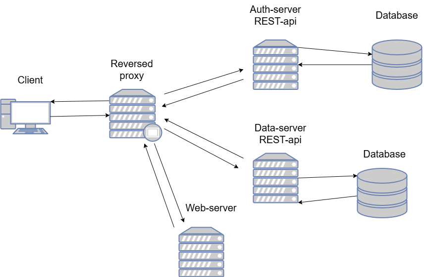

# SlimDreams

SlimDreams is a school project from the end of year 1 of Webprogrammerare program at Linneus University https://coursepress.lnu.se/kurser/mjukvaruutvecklingsprojekt/.  
  

SlimDreams is a mobile-first Progressive Web Application, that is intended to be used as an aid in a healthy weight-loss process for people over 18. It is deployed at is deployed at https://julia-lnu.duckdns.org/slimdreams/ .  

The system consists of:  
  
Frontend single-page application in Vue: https://github.com/JuliaLind/1dv613-web-server  
Auth-server in Express: https://github.com/JuliaLind/1dv613-auth-server  
Data-server in Express: https://github.com/JuliaLind/1dv613-data-server  

  

The application comes with ready to use food-item data for 6482 food items, which have been "scraped" from willys.se. The data is available under data-server/data/foods.json.  

## Clone down the repo
```git clone --recurse-submodules https://github.com/JuliaLind/slimdreams```.   

```cd slimdreams```  
```bash init.bash```  

To pull latest changes from submodules after you have cloned the project run:  
```bash upd.bash```  
```bash init.bash``` (comment out generating key parts if you do not want the old keys to be replaced)

## Start up the system locally in docker

Make sure you have started your Docker desktop. Then run:  

 ```bash start.bash```.  


In your browser you will find the web-application on http://localhost:4173/, the auth-server on http://localhost:5053/api/v1/ (endpoint descriptions are available in the README of the auth-server repo) and data-server on http://localhost:5054/api/v1/ (endpoint descriptions are available on http://localhost:5054/api/v1/docs/).  

## Testing 

Unfortunately testing from within containers is not working, but you can run all tests locally. Keep the dockerized application running for scenario tests and e2e tests, and run: 

```bash test.bash```

Or run the test commands from the test.bash script individually from each of the repos.  

## Close down

Close down the containers by running ```bash stop.bash``` from this directory.  